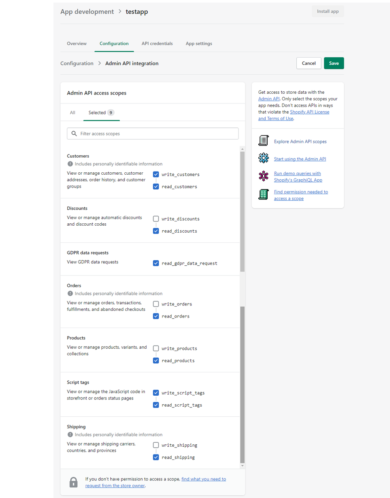


Marketin-Shopify店铺自建应用创建流程



背景

Marketin 应用APP上架到Shopify的应用市场之前，Shopify的商家可以通过店铺自建应用的方式使用Marketin产品，以下是自建应用的创建流程说明。


自建应用创建流程说明

流程中第1步-第4步是Shopify店铺自建应用的创建。  
流程中第5步-第7步是把Shopify自建应用获取到的信息更新到Marketin应用集成中，进行店铺绑定。

# Shopify店铺后台设置中，选择应用和销售渠道，点击“开发应用”

# 点击“创建应用”

## 填入新应用名称和选择应用开发者（默认填写自己店铺名称和邮箱地址）

## 应用创建后，点击配置后台API范围

## 配置-后台API集成访问范围，勾选权限（具体清单如下 2.3.1）

### 勾选所需权限（与下图勾选范围一致，一共9项）
后台API集成中访问范围清单 (只读取店铺订单/客户/商品/营销活动/物流等相关的必要数据，及补充客户信息)

## (配置-后台API集成）已选中确认勾选访问范围，点击“保存”

# 在 API凭据 中 ，安装应用

## 安装应用：确认安装

# 应用安装后，可以看到相关Token信息（第6步中需要）

# 登录Marketin的已注册账号，在Marketin - 应用 - 中，点击 “添加 Shopify应用管理

# 填写第4步中的信息，并点击“连接到Shopify”
（1）Shopify店铺的域名，格式必须为：

xxx.myshopify.com 
  
（2）第4步中Shopify中的访问令牌值 必须使用 Reveal token once 后的明文，Reveal token once后请妥善保管     
（3）第4步中Shopify中的API key值  
（4）第4步中Shopify中的API secret key值  

# 连接完成后，确保下图红框中的两个选项都勾选上，然后务必点击保存！


补充说明

1. 后台API访问令牌只能绑定使用一次，删除应用后，需要Shopify店铺后端重新创建自建应用，然后再进行Shopify应用集成
2. 如果Shopify店铺后端卸载或删除了自建应用，48小时后Marketin才会获取到Shopify的状态同步。在此期间，Marketin的应用状态仍处于启用中，但数据不会进行同步。48小时之后，Marketin的绑定会自动进行删除。