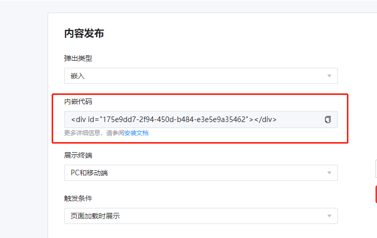


Marketin - 嵌入式弹窗使用说明


# 概览

1. 了解嵌入式弹窗

2. 创建嵌入式弹窗

3. 获取嵌入代码

4. 将代码粘贴到您的店铺网站源码中

5. 访问您的店铺验证嵌入式弹窗是否正常工作

# 详情

## 了解嵌入式弹窗

嵌入式弹窗是通过在您的店铺源码中添加嵌入代码，来实现弹窗展示的功能

> 弹窗展示的位置受代码片段所处位置的影响，在不同主题模式下也可能产生差异

## 创建嵌入式弹窗

1. 导航到营销弹窗>创建弹窗

2. 选择合适的弹窗模板开始编辑

3. 填写弹窗信息并选择定向条件

4. 选择“嵌入”作为弹窗类型

5. 前往编辑器修改弹窗内容及样式

6. 点击完成保存您的弹窗

## 获取嵌入代码片段

### 按照您的期望编辑弹窗内容后，可以内容发布-内嵌代码栏位复制该弹窗的代码片段

## 将代码粘贴到您的网站上（以Shopify建站为例）

最佳实践：将弹窗展示在店铺的页脚位置

如果您想将嵌入式弹窗放在店铺的页脚中，请按照以下步骤操作：

1. 进入您的Shopify店铺管理后台

2. 导航到在线商店>主题

3. 单击操作>编辑代码

4. 打开页脚.liquid主题文件

5. 找到要显示窗体的区域

6. 粘贴表单嵌入代码

7. 点击保存

弹窗将会显示在您网站的页脚中

# 其它

• 使用嵌入式弹窗功能依然需要您在应用中打开“添加用户互动行为监测”选项

• 粘贴代码片段需要访问您店铺网站源码，请在使用时联系您团队中的开发人员

• 如果您依然对嵌入式弹窗存在疑问，并希望让Marketin专属CSM帮助您完成，请联系我们